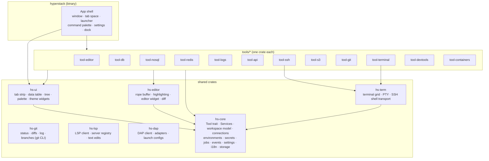
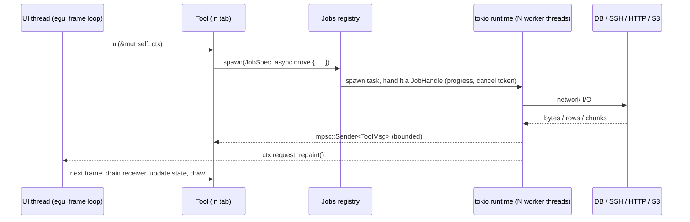

# Architecture

How the shop service fits together.

```mermaid
flowchart TB
    subgraph bin["hyperstack (binary)"]
        Shell["App shell<br/>window · tab space · launcher<br/>command palette · settings · dock"]
    end
    subgraph tools["tools/* (one crate each)"]
        Ed[tool-editor] ; Db[tool-db] ; Nq[tool-nosql] ; Rd[tool-redis] ; Lg[tool-logs] ; Api[tool-api] ; Ssh[tool-ssh]
        S3[tool-s3] ; Git[tool-git] ; Term[tool-terminal] ; Dev[tool-devtools] ; Ctr[tool-containers]
    end
    subgraph shared["shared crates"]
        UI["hs-ui<br/>tab strip · data table · tree · palette · theme widgets"]
        Editor["hs-editor<br/>rope buffer · highlighting · editor widget · diff"]
        GitCore["hs-git<br/>status · diffs · log · branches (git CLI)"]
        Lsp["hs-lsp<br/>LSP client · server registry · text edits"]
        Dap["hs-dap<br/>DAP client · adapters · launch configs"]
        TermCore["hs-term<br/>terminal grid · PTY · SSH shell transport"]
        Core["hs-core<br/>Tool trait · Services · workspace model · connections<br/>environments · secrets · jobs · events · settings · i18n · storage"]
    end
    Shell --> tools
    Shell --> UI
    tools --> UI
    tools --> Editor
    Ssh --> TermCore
    Term --> TermCore
    tools --> Core
    UI --> Core
    Editor --> Core
    TermCore --> Core
```

## Runtime

One request through the service:

```mermaid
sequenceDiagram
    participant UI as UI thread (egui frame loop)
    participant Tool as Tool (in tab)
    participant Jobs as Jobs registry
    participant Rt as tokio runtime (N worker threads)
    participant Remote as DB / SSH / HTTP / S3

    UI->>Tool: ui(&mut self, ctx)
    Tool->>Jobs: spawn(JobSpec, async move { … })
    Jobs->>Rt: spawn task, hand it a JobHandle (progress, cancel token)
    Rt->>Remote: network I/O
    Remote-->>Rt: bytes / rows / chunks
    Rt-->>Tool: mpsc::Sender<ToolMsg> (bounded)
    Rt-->>UI: ctx.request_repaint()
    UI->>Tool: next frame: drain receiver, update state, draw
```
